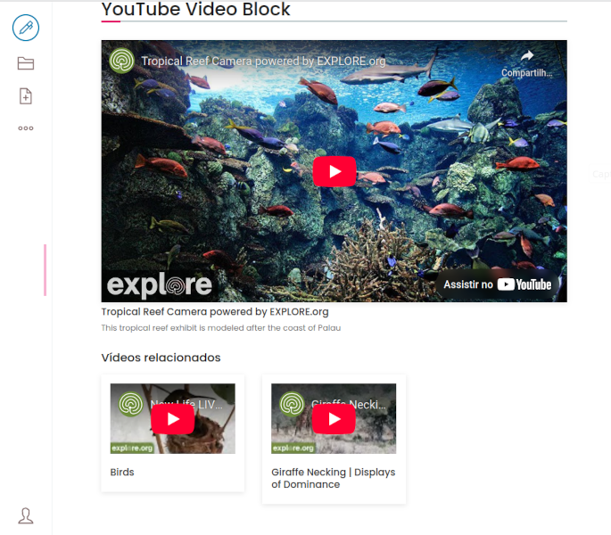

# YouTube Video Block for Volto

[](https://opensource.org/licenses/MIT)
[](https://github.com/plone/volto)

A Volto add-on that provides a YouTube video list block for your Plone/Volto website.



## Features

- Embed YouTube videos in your Volto content
- List multiple videos in a block format
- Easy integration with Volto's block system
- Configurable video display options

## Installation

1) Add the package to your Volto project:

```bash
yarn add @rondon-open/youtube-video-block
```

2) add the add-on to your package.json:

```js
"addons": [
    "@rondon-open/youtube-video-block"
],
```

## Usage

1. In your Volto editor, add a new block
2. Select the YouTube Video Block from the block chooser
3. Configure your video settings in the block's sidebar

## Development

### Requirements

- Node.js 16+
- Volto 18+

### Commands

- Run i18n extraction:
  ```bash
  yarn i18n
  ```

- Run a dry release (test without publishing):
  ```bash
  yarn dry-release
  ```

- Create a new release:
  ```bash
  yarn release
  ```

## Contributing

Contributions are welcome! Please open an issue or submit a pull request.

## License

MIT © [Rondon Open](https://github.com/rondon-open)